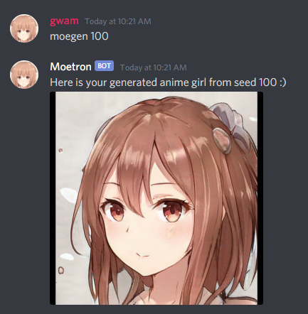
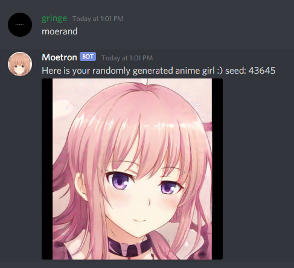
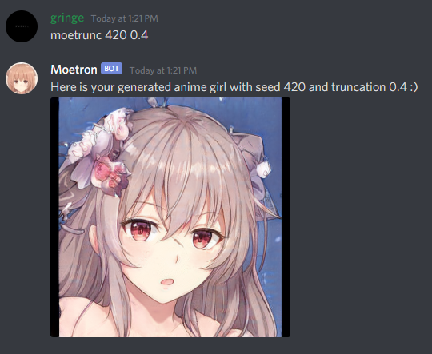
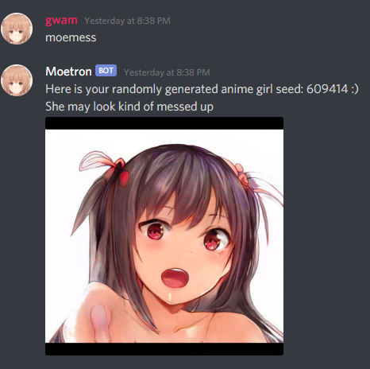
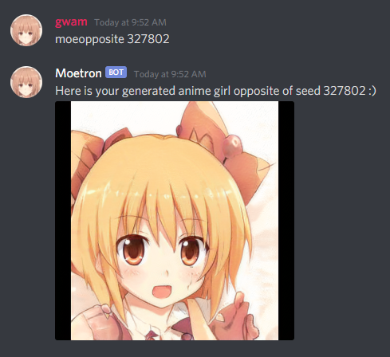
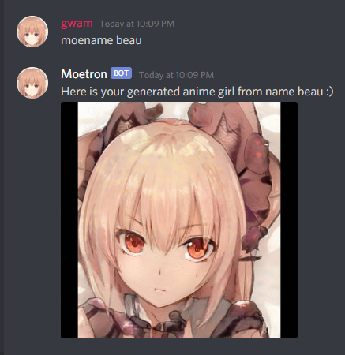
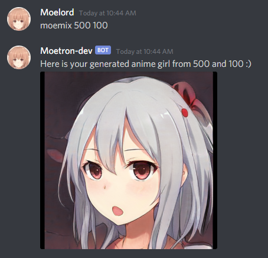

## Discord Bot using StyleGAN2 to generate anime face images.

This is just a simple discord bot that interfaces with the StyleGAN2 generator to create images.

## Commands:

**gen / generate** 
Generates an image from a given seed.

**rand / random** 
Generates an image from a random seed.

**trunc / truncate** 
Generates an image from the given seed with the provided truncation-psi.

**mess / messy** 
Generates an image from a random seed w/ truncation turned off.

**opp / opposite**
Generates an image from a given seed w/ truncation-psi flipped.

**name** 
Generates an image based on the hash of a string.

**mix** 
Mixes the style of either 2 seeds or 2 strings

## Whitelisting Feature
This bot uses a whitelisting feature to automatically leave guilds that aren't whitelisted. If you don't want this feature enabled you can just not create a whitelist.csv file, it won't remove servers if the file does not exist. Otherwise create a file whitelist.csv with the guild ids separated by ,

## Setup:

To get this working follow the steps on the official StyleGAN2 repo:
https://github.com/NVlabs/stylegan2

It's kind of a pain to set up everything... Honestly I'd just try to get StyleGAN2 running first on your machine, then you'll know that this will work. After you get it working, you should just need discord py and to set up your bot w/ discord to get your key.

After everything is setup run the bot using `python bot.py`

The model I used can be obtained from:
https://www.gwern.net/Faces#stylegan-2
you can use whatever model you want obviously, but this bot was built around using this one. Hence the "moe" naming and such.

All credits for the trained model goes to the original creator Aaron Gokaslan.

Currently images are kept in the results dir, but not tracked in vcs so if you get a image you really like and you're running the bot yourself you can find the image in the directory. Obviously this is under the assumption that you're only running the bot on a few servers and it isn't being spammed too much.

This bot is not used for commercial purposes, and derivatives of this work should not be used for commercial purposes. See the license for more information.

See the license under docs, it's the same as the stylegan2 license.
https://nvlabs.github.io/stylegan2/license.html

If you use this code in your bot or anything include the license and I'd appreciate it if you'd credit me as well as the creator of the network if you choose to use it :)

## Other:

**Questions**

Q) I see a lot of errors / warnings on startup, does that matter?

A) Probably not, tensorflow will probably give some deprecation warnings and on startup you may see some memory allocation warnings. You can ignore them. If the bot starts up you should be good to go, just give it a couple seconds.

Q) Can I use this for stuff other than anime images?

A) Sure, if you find a trained model that produces images that you want you can just replace the default network in the run_generator.py constructor and use that.

**Acknowledgement:**
* Aaron Gokaslan for the pre-trained model
* Gwern Branwen for all of their articles about StyleGAN.
* The creators of StyleGAN2, dnnlib is from there w/ all copyrights / attributions remaining.

**Future work**
* Not sure what else to add atm

**Contribution**
Feel free to make a PR. I'll probably eventually get around to reviewing it. There's simple unit tests, run them before making a PR. If you add any new commands to the cog add unit tests for the new commands as well. I'd also recommend testing out the bot yourself before making the PR, I have separate dev moetron I use to do full e2e testing before I commit changes.